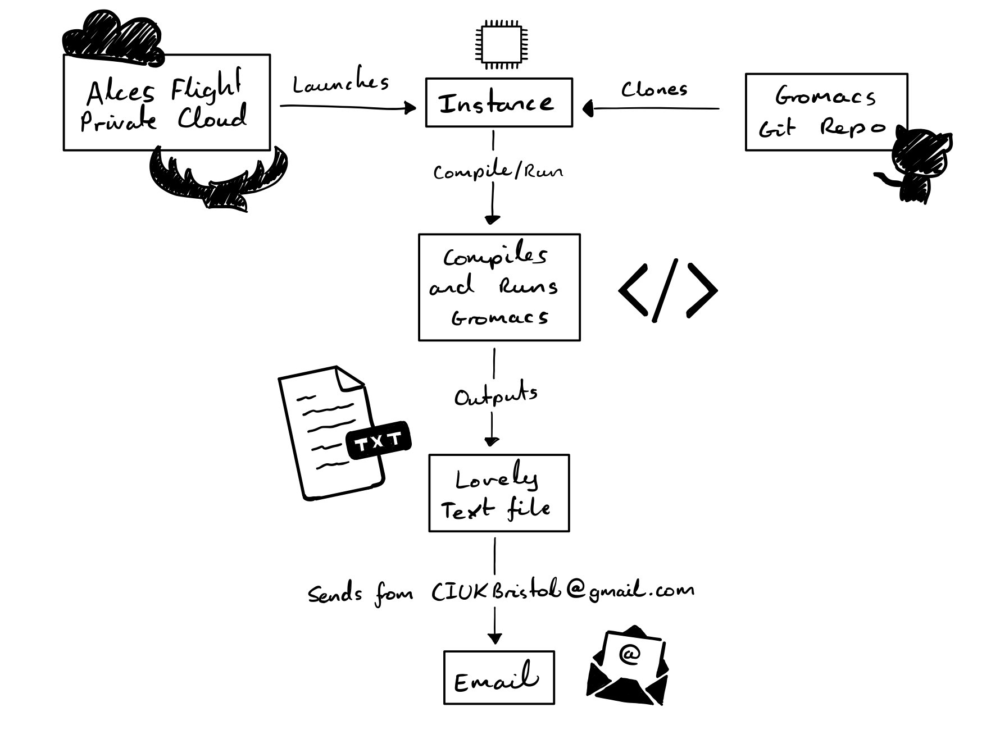
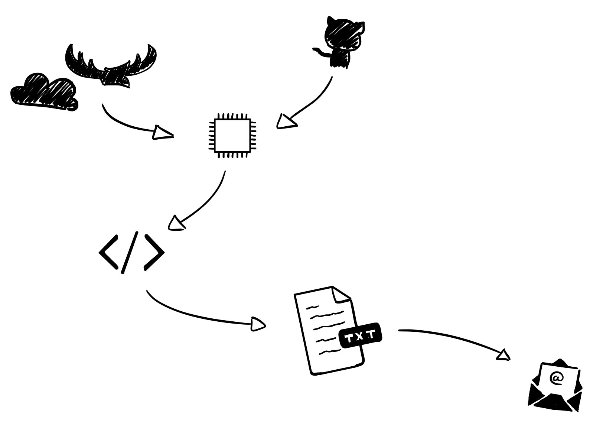

# CUIK_Bristol2

The challenge was approached to maximise our efficiency in collecting data from each system. We considered running tests manually to benchmark systems however decided running all tests from a bash script future proofed our work. This would allow us to test all benchmarks on cheap systems, and then run tests quickly on resource intensive systems. It would also allow for better automation for the final challenge.

## Challenge 1

### Original Plan

**Single-core integer and FP comparison:** 
To benchmark single core integer calculations, a custom matrix multiplication program was created. It takes an input, N, to create an NxN matrix. This matrix is then multiplied by itself with each resultant element being individually calculated. No effort has been taken to improve optimality (eg. implementation of Strassen's algorithm) as we wanted a test that was computationally intensive. The test outputs the time it takes to calculate the new multiplied matrix. From this FLOPS can be calculated. The same matrix multiplication method and code is also used for testing performance with floating point values.

**Multi-core single-node comparison:** Multi-core benchmarking is done in a similar fashion using the FP matrix multiplication code. This was parallelised using OpenMP pushing operations through the maximum amount of threads available to us. Again this code outputs a time for completion which can then be used to calculate FLOPS.

**Memory bandwidth** Stream benchmark was used to test for memory bandwidth.

**Interconnect latency** We use a simple Ping Pong test to benchmark interconnect latency, from the Gromax package.

**Interconnect bandwidth** Using the OpenMPI test that comes with the Phoronix test suite

**The interconnect bandwidth** is being tested by sending and recieving files of varying sizes and timing the operation. To do this, we have taken the script from the Academy Award winning film _"Shrek"_ and chopped it up.

**I/O disk performance** We run the IoZone benchmark specifying we only want to consider read/reread and write/rewrite scores ouputed as IOPS. This benchmark works with 2 Gb data packets.

**Filesystem transaction performance** ...

### New plan

The original plan failed catastrophically, their were too many errors to debug and too many dependancies to install. We fell back on the Phoronix Test suit since it seemed to have evertyhing we needed to test. The workflow for this task was still the same however. We'd write a bash script that executes the entire benchmarking program, outputs the results to a text file, and then sends to text file from instance through a sender email to one of our email accounts. Finally it shutsdown the instance. This automated process allows us to test as much as needed on the cheapest machine, then spend minimal time testing on expensive systems.

## Challenge 2

For Challenge 2, the best approach seemed to be cloning the gromacs git repository, compiling and running the program.

## Challenge 3

Challenge 3 could be completed with minimal alteration to our Challenge 1 methodology. For challenge 1 we created a simple bash script to run all the benchmarking scripts needed. We could adjust this by setting up the system to run a Gromacs job. We couldn't find an interesting way to launch this script along with setuping up the intance however trialed way to submit the results of the job via an email and then managed to terminate the instance and free up the hardware using `sudo shutdown -h now`.

Our workflow:

and a fully pictoral diagram:

